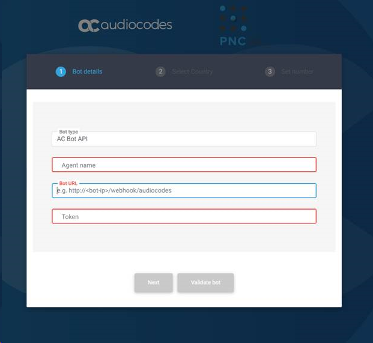

# AudioCodes Voice&#46;AI Gateway Channel for Rasa

AudioCodes Voice&#46;AI Gateway is an application that enables telephony access
for chatbots.

The Rasa integration is using a REST protocol named
[AC-Bot-API](https://techdocs.audiocodes.com/voice-ai-gateway/api/version-180/#VAIG_API/API_1.htm).

## Installation

The easiest way to install the package is through [PyPI](https://pypi.org/project/rasa-audiocodes).

```sh
pip install rasa-audiocodes
```

## Rasa Configuration

Add the following content to `credentials.yml`:

```yaml
rasa_audiocodes.AudiocodesInput:
  token: "CHOOSE_YOUR_TOKEN"
```

## Docker

If you're using Rasa on Docker, you can copy rasa_audiocodes and docker-compose.yml
to your application directory, and edit the volumes section to match your app directory.

If you already have a docker-compose file, just add this to the rasa volumes:

```yaml
      - ./rasa_audiocodes:/opt/venv/lib/python3.7/site-packages/rasa_audiocodes
```
## PNC Setup

The easiest way to start using VAIG is by visiting https://pnc.audiocodes.io.

You can get a phone number, and route it to your bot.

Configuration is straight-forward. Click the + sign, then enter the name
of the bot, URL and the token.

You can now click Validate to verify that the bot is accessible and the
audiocodes channel is configured correctly.



Click Next, then choose a country and a city to get a phone number.

After a minute, the number should be routed to your bot.

## Voice&#46;AI Gateway Configuration

If you maintain a VAIG instance, configure a provider with the following attributes:

```json
  {
    "name": "rasa",
    "type": "ac-bot-api",
    "botURL": "https://<RASA>/webhooks/audiocodes/webhook",
    "credentials": {
      "token": "CHOOSE_YOUR_TOKEN"
    }
  }
```
